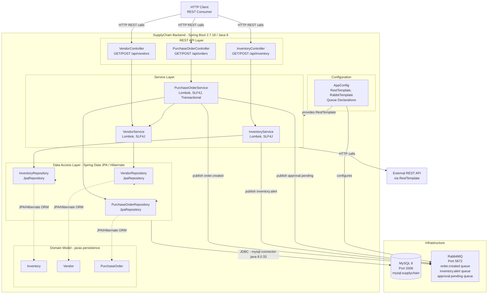

# Architecture Diagram

This diagram represents the current architecture of the SupplyChain Backend application, a Spring Boot 2.7.18 / Java 8 monolithic REST API with MySQL persistence and RabbitMQ messaging.

## Application Architecture

