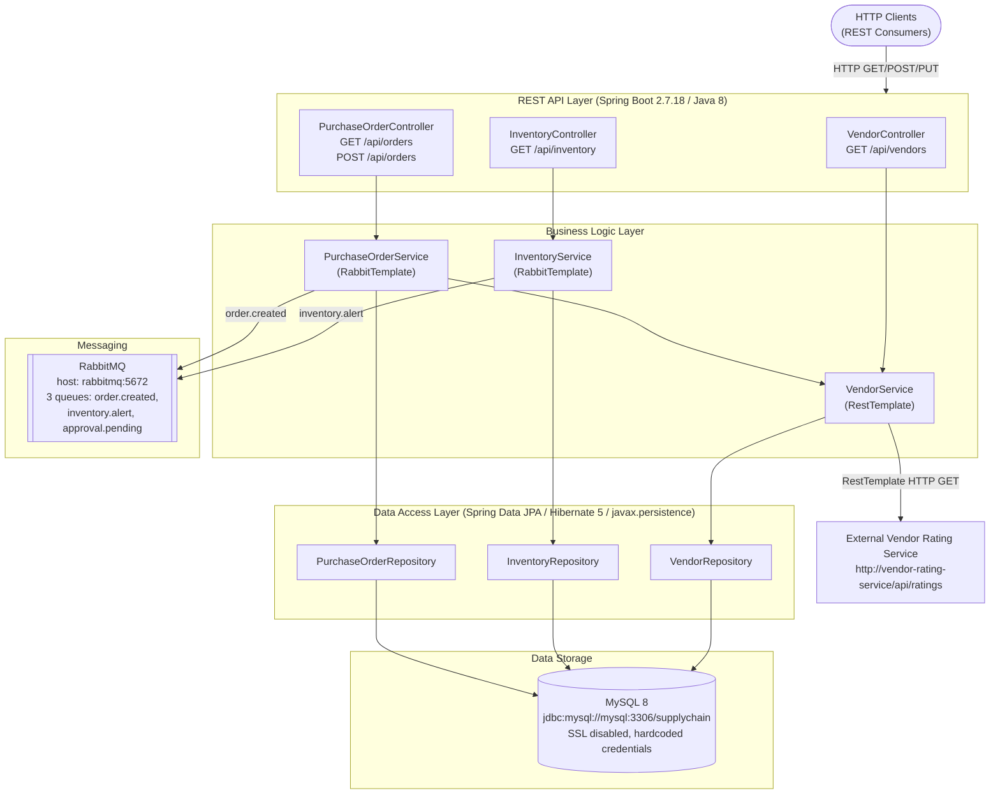

# Architecture Diagram

SupplyChain Backend is a Java 8 / Spring Boot 2.7.18 REST API for supply chain management, with MySQL for persistence and RabbitMQ for asynchronous messaging.

## Application Architecture

